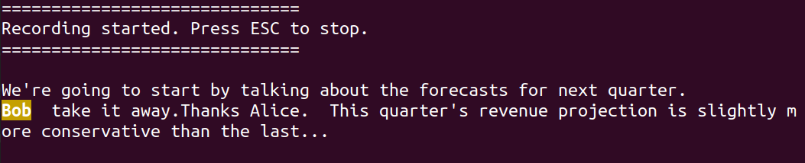

> AI can code?  I'm not worried.  Coding is only 10% of my job.
> 
> AI can attend meetings?  Fuck!  That's 90% of my job.

# What this is

An AI-powered tool to help you get the most out of your meetings.  Turn your transcript into a RAG pipeline for Q&A, 
analyze speaker stress throughout the meeting and what may have caused it, determine who spoke and how often, and 
get a near real time transcription with a rolling summary.

<em>Note1:
This tool needs to be run on a separate device from the one running the teleconferencing software. The device you 
run this tool from will record speaker output from the other device.  Therefore, it works best with high quality 
speakers and a high quality mic.  This is a limitation, but could be resolved with future work.  
For an explanation of why it is hard to simultaneously record input and output from the same device, 
see https://superuser.com/questions/769249/how-to-record-both-input-and-output-audio-simultaneously.
</em>

<em>Note2:
Be sure to check the laws about recording conversations in your area, and the areas of meeting participants, 
before recording anything.
</em>

# How it Works

You will probably want to set up a Python environment for this.  I used 3.8 for development, but 
later versions <em>should</em> work too.  This tool works on Unix based systems.  I have not 
(and will not) test it on Windows.

```commandline
python -m virtualenv env
source env/bin/activate
python -m pip install -r requirements.txt
```

You will probably also want to run this with a GPU.  Without it, processing will be far to slow.

## Recording a New Meeting

Run `asr_w_rolling_summary.py` to start a recording.  It will continue until you press the escape key.  While 
recording, a transcript will be printed to the terminal.  You can make the transcription faster (and less accurate) 
or slower (and more accurate) using the `buffer-size` command line arguments.  I found 10 seconds to be reasonable.  

A rolling summary will be printed every so often.  Use the `summary-buffers` argument to control how often.

You can track a keyword using the `word-to-track` argument.  This is useful for tuning out of meetings until your name 
is mentioned (not that anyone would ever do that).  Tracked words will print with highlighting as the transcription 
happens.



The recording will stop when you press the `Esc` key.  The audio will save to 
speaker_analysis/data/meeting_recording.wav and the transcript will save to transcript_rag/data/meeting_transcript.txt


## Interacting with the Transcript

You can use your own transcript from teleconferencing software, like Zoom, by saving it to 
transcript_rag/data/meeting_transcript.txt.  Otherwise, run `asr_w_rolling_summary.py` to create one. 

After a transcript is ready, start the chatbot UI to ask questions about the transcript:

```commandline
cd transcript_rag
python chatbot_ui.py
```


## Analyzing Speech from the Meeting

You can use your own recording from teleconferencing software, like Zoom, by saving it to 
speaker_analysis/data/meeting_recording.wav.  Otherwise, run `asr_w_rolling_summary.py` to create one. 

After a recording is ready, start the dashboard to view speaker analysis:

```commandline
cd speaker_analysis
python dashboard.py -hat <YOUR_HUGGINGFACE_ACCESS_TOKEN>
```

Note that this uses Pyannote, which requires you to have a HuggingFace account and accept the user agreement 
here: https://huggingface.co/pyannote/speaker-diarization-3.1.  You can create an access token from your user 
settings: https://huggingface.co/settings/tokens. 

Hover over the bars in the dashboard to see the transcribed text and its sentiment.


